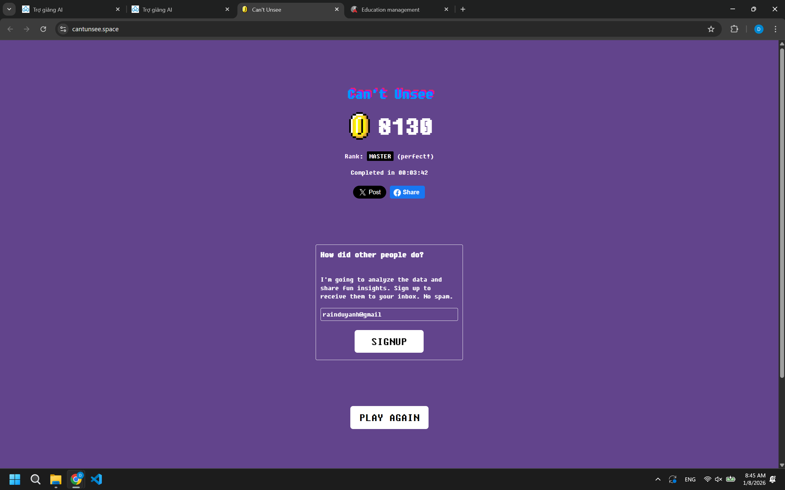
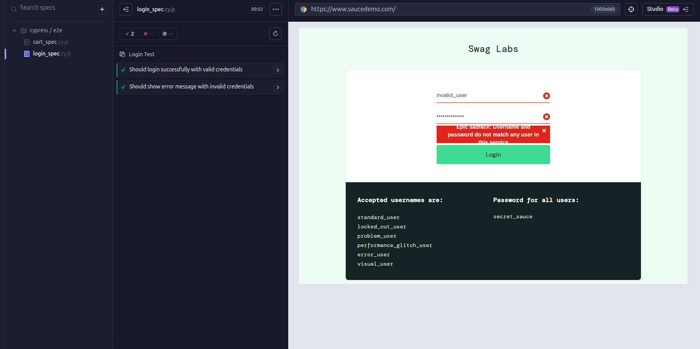
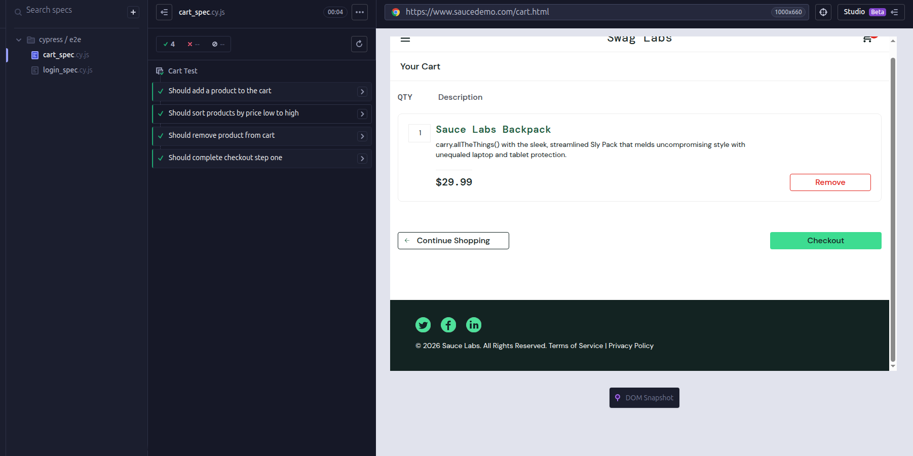
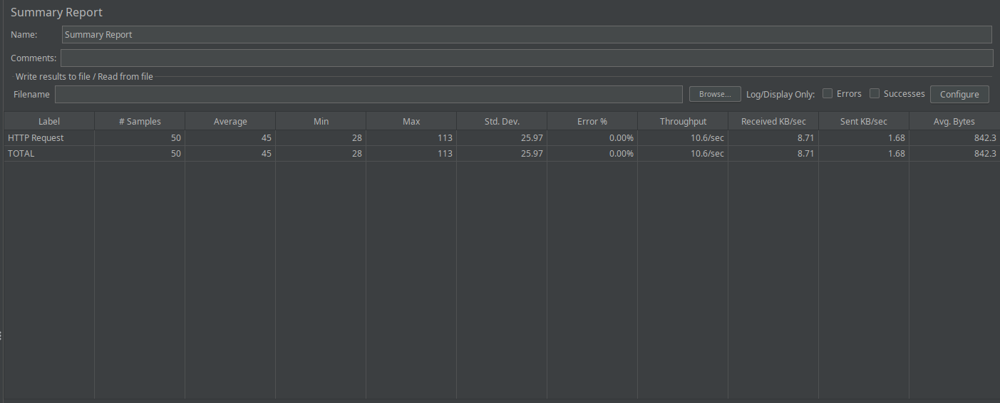
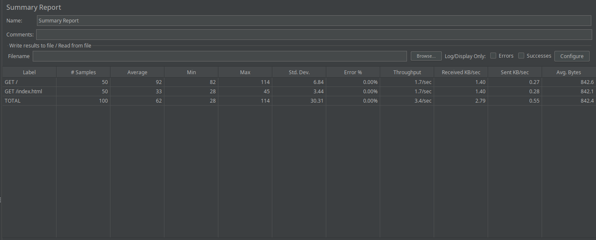
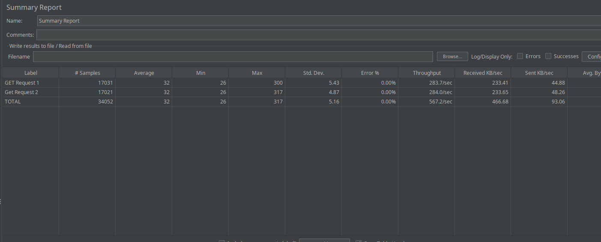

# Cantunsee Result

# SOFT-test

Dự án này là bài thực hành kiểm thử với JUnit 5. Tôi viết một class để phân tích điểm học sinh và dùng Maven để chạy Unit Test cho nó.

Chức năng chính

countExcellentStudents(List<Double> scores)
Đếm số học sinh đạt loại Giỏi (>= 8.0). Điểm < 0 hoặc > 10 thì bỏ qua.

calculateValidAverage(List<Double> scores)
Tính điểm trung bình của các điểm hợp lệ trong danh sách (chỉ lấy điểm từ 0 đến 10).

Cấu trúc dự án

Project được tổ chức theo chuẩn Maven:

src/main/java/nigalas/ : mã nguồn chính (StudentAnalyzer.java)

src/test/java/nigalas/ : mã kiểm thử (StudentAnalyzerTest.java)

pom.xml : cấu hình Maven + JUnit 5 + JDK

Yêu cầu hệ thống

Java JDK: 23

Apache Maven: 3.6.0 trở lên

Có thể làm bằng VS Code (có Extension Pack for Java)

Cách chạy test

Mở terminal tại thư mục có pom.xml rồi chạy:

mvn clean test

Nếu đúng hết thì Maven sẽ chạy toàn bộ test và báo BUILD SUCCESS.

# Cypress Result

# JMeter Result

# SOFTWARE TESTING PRACTICE REPORT – E-COMMERCE SYSTEM

## 1. Giới thiệu

Đây là bộ tài liệu thực hành kiểm thử phần mềm cho hệ thống Website E-Commerce giả lập.  
Dự án bao gồm đầy đủ các hoạt động kiểm thử từ lập kế hoạch, thiết kế test case, thực thi, ghi nhận lỗi cho đến phân tích số liệu và đưa ra quyết định phát hành.

Toàn bộ nội dung được xây dựng theo quy trình QA chuẩn và tổ chức rõ ràng theo từng nhóm tài liệu.

---

## 2. Cấu trúc tài liệu (Deliverables)

Các tài liệu Manual Testing được lưu trong thư mục:

`E-Commerce_Manual_Testing`

Chi tiết từng thành phần:

- 📄 **[Test Plan](/E-Commercial_Manual_Testing/Test%20Plan/Test_Plan.md)**  
  Mô tả phạm vi kiểm thử, chiến lược test, môi trường, rủi ro, điều kiện vào/ra và lịch trình thực hiện.

- 📋 **[Test Cases](/E-Commercial_Manual_Testing/Test%20Cases/Test_Cases.md)**  
  Danh sách 45 Test Cases bao phủ 3 module chính: Authentication, Product & Cart, Checkout.

- 🔗 **[RTM – Requirement Traceability Matrix](/E-Commercial_Manual_Testing/RTM/RTM.md)**  
  Ma trận truy vết yêu cầu đảm bảo 16/16 Requirement (R1 – R16) được cover 100%.

- 🐞 **[Bug Reports](/E-Commercial_Manual_Testing/Bug%20Reports/BugReport.md)**  
  Tổng hợp 10 lỗi được ghi nhận với đầy đủ thông tin: Severity, Steps to Reproduce, Expected Result, Actual Result.

- 📊 **[Test Report](/E-Commercial_Manual_Testing/Test%20Report/Test_Report.md)**  
  Báo cáo kết quả thực thi, phân tích lỗi và quyết định Release.

- 📈 **[Test Metrics](/E-Commercial_Manual_Testing/Test%20Metrics/Test_Metrics.md)**  
  Phân tích các chỉ số QA: Execution Rate, Pass Rate, Defect Density, Severity Distribution và Requirement Coverage.
